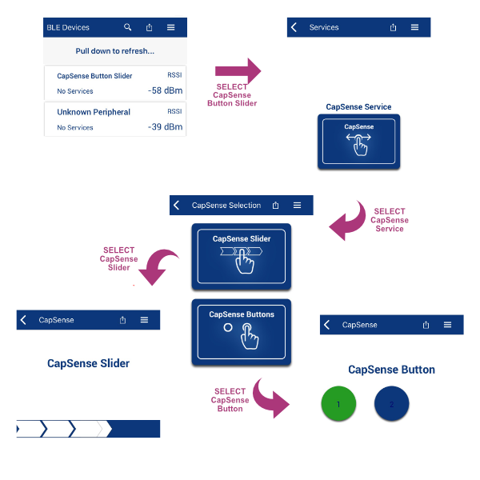
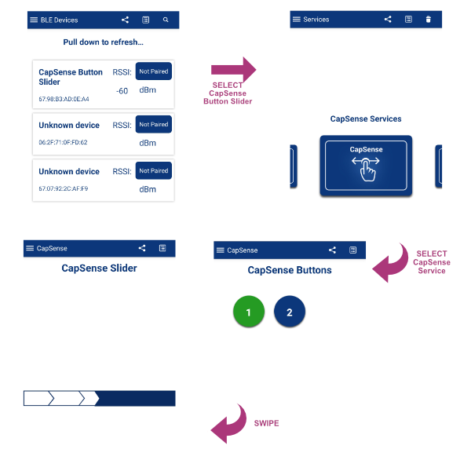
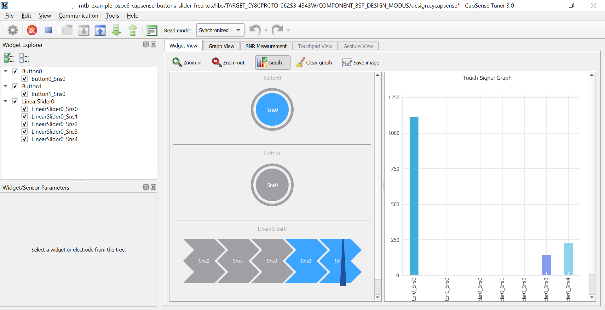
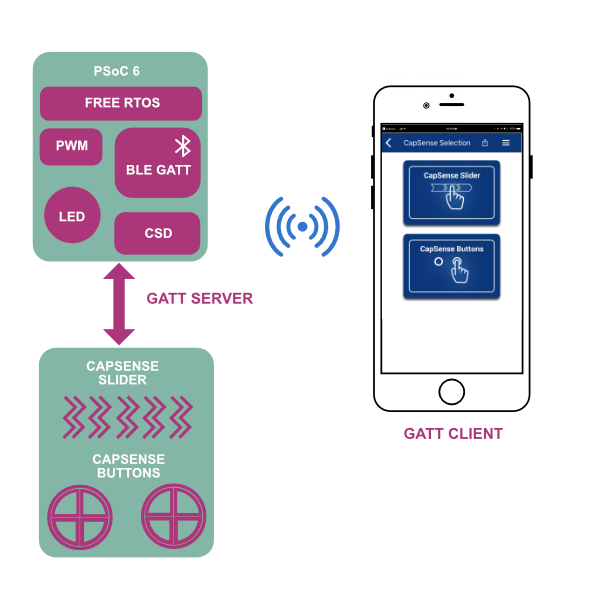

# AnyCloud: BLE CapSense Buttons and Slider

This code example features a BLE GATT Server with a 5-segment linear slider and two CapSense® buttons. Button 0 turns the LED ON, Button 1 turns the LED OFF, and the slider controls the brightness of the LED. The button status and slider data are send to the GATT Client over GATT notification. This project uses the CapSense Middleware Library; it is developed in the ModusToolbox® software environment.

This code example uses FreeRTOS. Visit the FreeRTOS website for documentation and API references.

[Provide feedback on this Code Example.](https://cypress.co1.qualtrics.com/jfe/form/SV_1NTns53sK2yiljn?Q_EED=eyJVbmlxdWUgRG9jIElkIjoiQ0UyMzAzMTciLCJTcGVjIE51bWJlciI6IjAwMi0zMDMxNyIsIkRvYyBUaXRsZSI6IkFueUNsb3VkOiBCTEUgQ2FwU2Vuc2UgQnV0dG9ucyBhbmQgU2xpZGVyIiwicmlkIjoiYXNyYSIsIkRvYyB2ZXJzaW9uIjoiMi4wLjAiLCJEb2MgTGFuZ3VhZ2UiOiJFbmdsaXNoIiwiRG9jIERpdmlzaW9uIjoiTUNEIiwiRG9jIEJVIjoiSUNXIiwiRG9jIEZhbWlseSI6IlBTT0MifQ==)

## Requirements

- [ModusToolbox® software](https://www.cypress.com/products/modustoolbox-software-environment) v2.2
    **Note:** This code example version requires ModusToolbox software version 2.2 or later and is not backward compatible with v2.1 or older versions. If you cannot move to ModusToolbox v2.2, use the latest compatible version of this example: [latest-v1.X](https://github.com/cypresssemiconductorco/mtb-example-anycloud-ble-capsense-buttons-slider/tree/latest-v1.X).
- Board Support Package (BSP) minimum required version: 2.0.0
- Programming Language: C
- Associated Parts: [PSoC® 6 MCU](http://www.cypress.com/PSoC6) parts with CYW43012, CYW4343W, and CYW43438

## Supported Toolchains (make variable 'TOOLCHAIN')

- GNU Arm® Embedded Compiler v9.3.1 (`GCC_ARM`) - Default value of `TOOLCHAIN`
- IAR C/C++ compiler v8.42.2 (`IAR`)

## Supported Kits (make variable 'TARGET')

- [PSoC 6 WiFi-BT Pioneer Kit](https://www.cypress.com/CY8CKIT-062-WiFi-BT) (`CY8CKIT-062-WiFi-BT`) - Default value of `TARGET`
- [PSoC 6 Wi-Fi BT Prototyping Kit](https://www.cypress.com/CY8CPROTO-062-4343W) (`CY8CPROTO-062-4343W`)
- [PSoC 62S2 Wi-Fi BT Pioneer Kit](https://www.cypress.com/CY8CKIT-062S2-43012) (`CY8CKIT-062S2-43012`)
- [*PSoC 62S1 Wi-Fi BT Pioneer Kit](https://www.cypress.com/CYW9P62S1-43012EVB-01) (`CYW9P62S1-43012EVB-01`)
- [PSoC 62S2 Wi-Fi BT Pioneer Kit](https://www.cypress.com/CYW9P62S1-43438EVB-01) (`CYW9P62S1-43438EVB-01`)

## Hardware Setup
This example uses the board's default configuration. See the kit user guide to ensure that the board is configured correctly.

**Note:** The PSoC 6 BLE Pioneer Kit (CY8CKIT-062-BLE) and the PSoC 6 WiFi-BT Pioneer Kit (CY8CKIT-062-WIFI-BT) ship with KitProg2 installed. The ModusToolbox software requires KitProg3. Before using this code example, make sure that the board is upgraded to KitProg3. The tool and instructions are available in the [Firmware Loader](https://github.com/cypresssemiconductorco/Firmware-loader) GitHub repository. If you do not upgrade, you will see an error like "unable to find CMSIS-DAP device" or "KitProg firmware is out of date".

## Software Setup

Download the CySmart™ app for [iOS](https://itunes.apple.com/us/app/cysmart/id928939093?mt=8) or [Android](https://play.google.com/store/apps/details?id=com.cypress.cysmart).

You can also use the [CySmart Host Emulation Tool](http://www.cypress.com/go/cysmart) Windows PC application if you have access to the [CY5677 CySmart BLE 4.2 USB Dongle](http://www.cypress.com/documentation/development-kitsboards/cy5677-cysmart-bluetooth-low-energy-ble-42-usb-dongle). You can also use other Android or iOS apps that support the Immediate Alert Service (IAS).

Scan the following QR codes from your mobile phone to download the CySmart app.


Install a terminal emulator if you don't have one. Instructions in this document use [Tera Term](https://ttssh2.osdn.jp/index.html.en).

## Using the Code Example

### In Eclipse IDE for ModusToolbox:

1. Click the **New Application** link in the **Quick Panel** (or, use **File** > **New** > **ModusToolbox Application**). This launches the [Project Creator](http://www.cypress.com/ModusToolboxProjectCreator) tool.

2. Pick a kit supported by the code example from the list shown in the **Project Creator - Choose Board Support Package (BSP)** dialog.

   When you select a supported kit, the example is reconfigured automatically to work with the kit. To work with a different supported kit later, use the [Library Manager](https://www.cypress.com/ModusToolboxLibraryManager) to choose the BSP for the supported kit. You can use the Library Manager to select or update the BSP and firmware libraries used in this application. To access the Library Manager, click the link from the **Quick Panel**.

   You can also just start the application creation process again and select a different kit.

   If you want to use the application for a kit not listed here, you may need to update the source files. If the kit does not have the required resources, the application may not work.

3. In the **Project Creator - Select Application** dialog, choose the example by enabling the checkbox.

4. Optionally, change the suggested **New Application Name**.

5. Enter the local path in the **Application(s) Root Path** field to indicate where the application needs to be created.

   Applications that can share libraries can be placed in the same root path.

6. Click **Create** to complete the application creation process.

For more details, see the [Eclipse IDE for ModusToolbox User Guide](https://www.cypress.com/MTBEclipseIDEUserGuide) (locally available at *{ModusToolbox install directory}/ide_{version}/docs/mt_ide_user_guide.pdf*).

### In Command-line Interface (CLI):

ModusToolbox provides the Project Creator as both a GUI tool and a command line tool to easily create one or more ModusToolbox applications. See the "Project Creator Tools" section of the [ModusToolbox User Guide](https://www.cypress.com/ModusToolboxUserGuide) for more details.

Alternatively, you can manually create the application using the following steps:

1. Download and unzip this repository onto your local machine, or clone the repository.

2. Open a CLI terminal and navigate to the application folder.

   On Linux and macOS, you can use any terminal application. On Windows, open the **modus-shell** app from the Start menu.

   **Note:** The cloned application contains a default BSP file (*TARGET_xxx.mtb*) in the *deps* folder. Use the [Library Manager](https://www.cypress.com/ModusToolboxLibraryManager) (`make modlibs` command) to select and download a different BSP file, if required. If the selected kit does not have the required resources or is not [supported](#supported-kits-make-variable-target), the application may not work.

3. Import the required libraries by executing the `make getlibs` command.

Various CLI tools include a `-h` option that prints help information to the terminal screen about that tool. For more details, see the [ModusToolbox User Guide](https://www.cypress.com/ModusToolboxUserGuide) (locally available at *{ModusToolbox install directory}/docs_{version}/mtb_user_guide.pdf*).

### In Third-party IDEs:

1. Follow the instructions from the [CLI](#in-command-line-interface-cli) section to create the application, and import the libraries using the `make getlibs` command.

2. Export the application to a supported IDE using the `make <ide>` command.

    For a list of supported IDEs and more details, see the "Exporting to IDEs" section of the [ModusToolbox User Guide](https://www.cypress.com/ModusToolboxUserGuide) (locally available at *{ModusToolbox install directory}/docs_{version}/mtb_user_guide.pdf*.

3. Follow the instructions displayed in the terminal to create or import the application as an IDE project.

## Operation
1. Connect the board to your PC using the provided USB cable through the KitProg3 USB connector.

2. Open a terminal program and select the KitProg3 COM port. Set the serial port parameters to 8N1 and 115200 baud.

3. Program the board.

   - **Using Eclipse IDE for ModusToolbox:**

      1. Select the application project in the Project Explorer.

      2. In the **Quick Panel**, scroll down, and click **\<Application Name> Program (KitProg3_MiniProg4)**.

   - **Using CLI:**

     From the terminal, execute the `make program` command to build and program the application using the default toolchain to the default target. You can specify a target and toolchain manually:
      ```
      make program TARGET=<BSP> TOOLCHAIN=<toolchain>
      ```

      Example:
      ```
      make program TARGET=CY8CKIT-062-WiFi-BT TOOLCHAIN=GCC_ARM
      ```

        **Note:**  Before building the application, ensure that the *deps* folder contains the BSP file (*TARGET_xxx.lib*) corresponding to the TARGET. Execute the `make getlibs` command to fetch the BSP contents before building the application.

4. After programming, the application starts automatically. Observe the messages on the UART terminal, and wait for the device to make all the required connections. Use the KitProg3 COM port to view the Bluetooth stack and application trace messages in the terminal window as shown in Figure 1.

     **Figure 1. Log Messages on KitProg3 COM Port**

     

5. To test the application, touch CapSense button 1 (BTN1) to turn the LED OFF, touch CapSense Button 0 (BTN0) to turn the LED ON, and touch the slider in different positions to change the brightness.

6.	To test using the CySmart mobile app, do the following (see equivalent CySmart app screenshots in Figure 1):

    1. Turn ON Bluetooth on your Android or iOS device.

    2. Launch the CySmart app.

    3. Press the reset switch on the CY8CKIT-062-WiFi-BT kit to start sending advertisements. The red LED (LED1) starts glowing. Touch the slider to change the LED brightness. Advertising will stop after 90 seconds if a connection has not been established.

    4. Swipe down on the CySmart app home screen to start scanning for BLE Peripherals; your device (“CapSense Button Slider”) appears in the CySmart app home screen. Select your device to establish a BLE connection.

       Two Services are shown in the CySmart carousel view.

    6. Select the 'CapSense Slider' Profile from the Services. Touch the slider and change its position on the board. It  changes the slider graphic pattern on the app screen. In addition, the brightness of the LED changes based on the slider position.

    7. Select the 'CapSense Buttons' Profile from the Services. Touch Button 0 and Button 1 to change the button graphic on the app screen; the LED status toggles ON/OFF.


Figure 2 and Figure 3 show the steps for using the CySmart App on iOS and Android respectively.

**Figure 2. Testing with the CySmart App on iOS**



**Figure 3. Testing with the CySmart App on Android**



7. You can also monitor the CapSense data using the CapSense Tuner application as follows:

   **Monitor Data Using CapSense Tuner**

    1. Open CapSense Tuner from the IDE Quick Panel.

        You can also run the CapSense Tuner application standalone from *{ModusToolbox install directory}/ModusToolbox/tools_{version}/capsense-configurator/capsense-tuner*. In this case, after opening the application, select **File** > **Open** and open the *design.cycapsense* file for the respective kit, which is present in the *TARGET_\<BSP-NAME>/{version}/COMPONENT_BSP_DESIGN_MODUS* or *COMPONENT_CUSTOM_DESIGN_MODUS* folder.

    2. Ensure that the kit is in KitProg3 mode. See [Firmware-loader](https://github.com/cypresssemiconductorco/Firmware-loader) to learn on how to update the firmware and switch to KitProg3 mode.

    3. In the Tuner application, click **Tuner Communication Setup** or select **Tools** > **Tuner Communication Setup**. In the window that appears, select the I2C checkbox under KitProg3 and configure as follows:

       - I2C Address: 8
       - Sub-address: 2-Bytes
       - Speed (kHz): 400

    5. Click **Connect**, or select **Communication** > **Connect**.

    6. Click **Start**, or select **Communication** > **Start**.

    Under the **Widget View** tab, you can see the corresponding widgets highlighted in blue color when you touch the button or slider. You can also view the sensor data in the **Graph View** tab. For example, to view the sensor data for Button 0, select **Button0_Rx0** under **Button0**.

    Figure 4 shows the CapSense Tuner displaying the status of a touch on Button 0 and LinearSlider 0.

    **Figure 4. CapSense Tuner Showing Touch Data**

    

    The CapSense Tuner can also be used for tuning CapSense parameters, and measuring signal-to-noise ratio (SNR). See the [ModusToolbox CapSense Tuner Guide](https://www.cypress.com/ModusToolboxCapSenseTuner) (**Help** > **View Help**) and [AN85951 – PSoC 4 and PSoC 6 MCU CapSense Design Guide](https://www.cypress.com/an85951) for more details on selecting the tuning parameters.

## Debugging

You can debug the example to step through the code. In the IDE, use the **\<Application Name> Debug (KitProg3_MiniProg4)** configuration in the **Quick Panel**. For more details, see the "Program and Debug" section in the Eclipse IDE for ModusToolbox User Guide.

**Note:** **(Only while debugging)** On the CM4 CPU, some code in `main()` may execute before the debugger halts at the beginning of `main()`. This means that some code executes twice - once before the debugger stops execution, and again after the debugger resets the program counter to the beginning of `main()`. See [KBA231071](https://community.cypress.com/docs/DOC-21143) to learn about this and for the workaround.

## Design and Implementation

The ‘BLE CapSense Buttons and Slider’ is a BLE GATT Server where the CapSense buttons and slider data is stored and notified to the client; it scans a self-capacitance (CSD) based, 5-element CapSense slider and two mutual capacitance (CSX) CapSense buttons for user input.

See [AN85951 – PSoC 4 and PSoC 6 MCU CapSense Design Guide](https://www.cypress.com/an85951) for more details on CapSense features and usage.

In this application, the state of the user LED is controlled based on user inputs provided using the CapSense buttons and slider. A PWM HAL resource is configured for controlling the brightness of the LED. Touching Button 0 turns the LED ON; and touching Button 1 turns the LED OFF. The brightness of the LED is set based on the touch position on the CapSense slider.

The [ModusToolbox CapSense Configurator Tool Guide](https://www.cypress.com/ModusToolboxCapSenseConfig) provides step-by-step instructions on how to configure CapSense in the application. The CapSense Configurator and Tuner tools can be launched from the CSD personality in the Device Configurator tool.

The application uses an [EZI2C HAL](https://cypresssemiconductorco.github.io/psoc6hal/html/group__group__hal__ezi2c.html) interface for communicating with the CapSense Tuner.

The firmware uses FreeRTOS to execute the tasks required by this application. The following tasks are created:

1. **CapSense task:** Initializes the CapSense Hardware block, processes the touch input, and sends a command to the LED task to update the LED status.

2. **LED task:** Initializes the TCPWM in PWM mode for driving the LED, and updates the status of the LED based on the received command.

3. **BLE task:** Initializes the Bluetooth Stack and GATT services, and sends the CapSense buttons and slider values to the client via notification.

A FreeRTOS-based timer is used for making the CapSense scan periodic; a queue is used for communication between the CapSense task and LED task. *FreeRTOSConfig.h* contains the FreeRTOS settings and configuration.

**Figure 5. CapSense Buttons and Slider Implementation**



## Operation at Custom Power Supply Voltages

The application is configured to work with the default operating voltage of the kit.

**Table 1. Operating Voltages Supported by the Kits**

| Kit                   | Supported Operating Voltages | Default Operating Voltage |
| :-------------------- | ---------------------------- | ------------------------- |
| CY8CPROTO-062-4343W   | 3.3 V / 1.8 V                | 3.3 V                     |
| CY8CKIT-062-WIFI-BT   | 3.3 V / 1.8 V                | 3.3 V                     |
| CY8CKIT-062S2-43012   | 3.3 V / 1.8 V                | 3.3 V                     |
| CYW9P62S1-43438EVB-01 | 3.3 V only                   | 3.3 V                     |
| CYW9P62S1-43012EVB-01 | 1.8 V only                   | 1.8 V                     |

For kits that support multiple operating voltages, the default BSP configuration provided by the *design.modus* file should be customized. Do the following to use the example at a custom power supply, such as 1.8 V:

1. Create a directory at the root of the application to hold any custom BSP configuration files: *\<application_folder>/COMPONENT_CUSTOM_DESIGN_MODUS*.

2. Create a subdirectory for each target that needs to be modified to work at a custom power supply:  *\<application_folder>/COMPONENT_CUSTOM_DESIGN_MODUS/TARGET_\<kit>*.

3. Copy the *design.modus* file and other configuration files (from the *../mtb_shared/TARGET_\<kit>/{version}/COMPONENT_BSP_DESIGN_MODUS*) directory and paste them into the new directory for the target.

4. In the application's Makefile, update the following lines:
   ```
   DISABLE_COMPONENTS += BSP_DESIGN_MODUS
   COMPONENTS += CUSTOM_DESIGN_MODUS
   ```
5. Launch the [Device Configurator](https://www.cypress.com/ModusToolboxDeviceConfig) tool using the Quick Panel link in the IDE. This opens the *design.modus* file from the newly created *COMPONENT_CUSTOM_DESIGN_MODUS/TARGET_\<kit>* folder; you are now free to customize the configuration as required.

6. Update the *Operating Conditions* parameters in Power Settings with the desired voltage and select **File** > **Save**.

   **Figure 6. Power Settings to Work with 1.8 V**

   

7. Change the jumper/switch setting as follows:

   **Table 2. Jumper/Switch Position for 1.8 V Operation**

   | Kit                   | Jumper/Switch Position |
   | :--------------------- | --------------------- |
   | CY8CPROTO-062-4343W   | J3 (1-2)               |
   | CY8CKIT-062-WIFI-BT   | SW5 (1-2)              |
   | CY8CKIT-062S2-43012   | J14 (1-2)              |
   | CY8CPROTO-062S3-4343W | J3 (1-2)               |

8. Re-build and program the application to evaluate the application at the new power setting.

### Resources and Settings

This section explains the ModusToolbox resources and their configuration as used in this code example. Note that all the configuration explained in this section has already been done in the code example.

- **Device Configurator:** ModusToolbox stores the configuration settings of the application in the *design.modus* file. This file is used by the Device Configurator, which generates the configuration firmware. This firmware is stored in the application’s *GeneratedSource* folder. By default, all applications in a workspace share the same *design.modus* file - i.e., they share the same pin configuration. Each BSP has a default *design.modus* file in the *mtb_shared\TARGET_\<bsp name\>\\<version\>\COMPONENT_BSP_DESIGN_MODUS* directory. It is not recommended to modify the configuration of a standard BSP directly. To modify the configuration for a single application or to create a custom BSP, see the [ModusToolbox User Guide](https://www.cypress.com/file/504361/download). This example uses the default configuration.
See the
[Device Configurator Guide](https://www.cypress.com/ModusToolboxDeviceConfig).

- **Bluetooth Configurator:** The Bluetooth peripheral has an additional configurator called the “Bluetooth Configurator” that is used to generate the BLE GATT database and various bluetooth settings for the application. These settings are stored in the file named *design.cybt*. Note that unlike the Device Configurator, the Bluetooth Configurator settings and files are local to each respective application. As explained in the [Design and Implementation](#design-and-implementation) section, the only extra service added is the Immediate Alert Service (IAS).
 See the [Bluetooth Configurator Guide](https://www.cypress.com/ModusToolboxBLEConfig).

**Table 3. Application Resources**

|  File Name  |  Comments  |
|-----------------------------------|-------------------------------------------------------|
|*main.c* | Contains the functions to create FreeRTOS tasks for CapSense, BLE, and LED modules. This is the entry point for execution of the user application code after device startup.|
|*app_bt_cfg.c, app_bt_cfg.h* |	Contain the runtime Bluetooth stack configuration parameters such as the device name and  advertisement/ connection settings. Note that the name that the device uses for advertising (“CapSense Button Slider”) is defined in *app_bt_cfg.c*.|
|*cycfg_gatt_db.c, cycfg_gatt_db.h*|	Files in the *GeneratedSource* folder under the application folder. They contain the GATT database information generated using the Bluetooth Configurator tool.|
|*ble_task.c, ble_task.h*|Contain the code for the Bluetooth stack event handler functions. |
|*capsense_task.c, capsense_task.h*	|Contain the code for CapSense processing and handler functions.|
|*led_task.c, led_task.h*	|Contain the code for controlling the LED with PWM.|

## Related Resources

| Application Notes                                            |                                                              |
| :----------------------------------------------------------- | :----------------------------------------------------------- |
| [AN228571](https://www.cypress.com/AN228571) – Getting Started with PSoC 6 MCU on ModusToolbox | Describes PSoC 6 MCU devices and how to build your first application with ModusToolbox |
| [AN221774](https://www.cypress.com/AN221774) – Getting Started with PSoC 6 MCU on PSoC Creator | Describes PSoC 6 MCU devices and how to build your first application with PSoC Creator |
| [AN210781](https://www.cypress.com/AN210781) – Getting Started with PSoC 6 MCU with Bluetooth Low Energy (BLE) Connectivity on PSoC Creator | Describes PSoC 6 MCU with BLE Connectivity devices and how to build your first application with PSoC Creator |
| [AN215656](https://www.cypress.com/AN215656) – PSoC 6 MCU: Dual-CPU System Design | Describes the dual-CPU architecture in PSoC 6 MCU, and shows how to build a simple dual-CPU design |
| **Code Examples**                                            |                                                              |
| [Using ModusToolbox](https://github.com/cypresssemiconductorco/Code-Examples-for-ModusToolbox-Software) | [Using PSoC Creator](https://www.cypress.com/documentation/code-examples/psoc-6-mcu-code-examples) |
| **Device Documentation**                                     |                                                              |
| [PSoC 6 MCU Datasheets](https://www.cypress.com/search/all?f[0]=meta_type%3Atechnical_documents&f[1]=resource_meta_type%3A575&f[2]=field_related_products%3A114026) | [PSoC 6 Technical Reference Manuals](https://www.cypress.com/search/all/PSoC%206%20Technical%20Reference%20Manual?f[0]=meta_type%3Atechnical_documents&f[1]=resource_meta_type%3A583) |
| **Development Kits**                                         | Buy at www.cypress.com                                       |
| [CY8CKIT-062-BLE](https://www.cypress.com/CY8CKIT-062-BLE) PSoC 6 BLE Pioneer Kit | [CY8CKIT-062-WiFi-BT](https://www.cypress.com/CY8CKIT-062-WiFi-BT) PSoC 6 WiFi-BT Pioneer Kit |
| [CY8CPROTO-063-BLE](https://www.cypress.com/CY8CPROTO-063-BLE) PSoC 6 BLE Prototyping Kit | [CY8CPROTO-062-4343W](https://www.cypress.com/CY8CPROTO-062-4343W) PSoC 6 Wi-Fi BT Prototyping Kit |
| [CY8CKIT-062S2-43012](https://www.cypress.com/CY8CKIT-062S2-43012) PSoC 62S2 Wi-Fi BT Pioneer Kit | [CY8CPROTO-062S3-4343W](https://www.cypress.com/CY8CPROTO-062S3-4343W) PSoC 62S3 Wi-Fi BT Prototyping Kit |
| [CYW9P62S1-43438EVB-01](https://www.cypress.com/CYW9P62S1-43438EVB-01) PSoC 62S1 Wi-Fi BT Pioneer Kit | [CYW9P62S1-43012EVB-01](https://www.cypress.com/CYW9P62S1-43012EVB-01) PSoC 62S1 Wi-Fi BT Pioneer Kit |
| [CY8CKIT-064B0S2-4343W](http://www.cypress.com/CY8CKIT-064B0S2-4343W) PSoC 64 Secure Boot Wi-Fi BT Pioneer Kit |
| **Libraries**                                                |                                                              |
| PSoC 6 Peripheral Driver Library (PDL) and docs  | [mtb-pdl-cat1](https://github.com/cypresssemiconductorco/mtb-pdl-cat1) on GitHub |
| Cypress Hardware Abstraction Layer (HAL) Library and docs     | [mtb-hal-cat1](https://github.com/cypresssemiconductorco/mtb-hal-cat1) on GitHub |
| Retarget-IO - A utility library to retarget the standard input/output (STDIO) messages to a UART port | [retarget-io](https://github.com/cypresssemiconductorco/retarget-io) on GitHub |
| bluetooth-freeRTOS | Cypress WICED BT/BLE Host Stack solution [bluetooth-freeRTOS](http://github.com/cypresssemiconductorco/bluetooth-freertos) on GitHub |
| **Middleware**                                               |                                                              |
| CapSense® library and docs                                    | [capsense](https://github.com/cypresssemiconductorco/capsense) on GitHub |
| Links to all PSoC 6 MCU Middleware                           | [psoc6-middleware](https://github.com/cypresssemiconductorco/psoc6-middleware) on GitHub |
| **Tools**                                                    |                                                              |
| [Eclipse IDE for ModusToolbox](https://www.cypress.com/modustoolbox)     | The cross-platform, Eclipse-based IDE for IoT designers that supports application configuration and development targeting converged MCU and wireless systems.             |
| [PSoC Creator™](https://www.cypress.com/products/psoc-creator-integrated-design-environment-ide) | The Cypress IDE for PSoC and FM0+ MCU development.            |

## Other Resources


Cypress provides a wealth of data at www.cypress.com to help you select the right device, and quickly and effectively integrate it into your design.

For PSoC 6 MCU devices, see [How to Design with PSoC 6 MCU - KBA223067](https://community.cypress.com/docs/DOC-14644) in the Cypress community.
## Document History

Document Title: *CE230317* – *AnyCloud: BLE CapSense Buttons and Slider*

| Version | Description of Change |
| ------- | --------------------- |
| 1.0.0   | New code example.      |
| 2.0.0   | Major update to support ModusToolbox software v2.2; added support for new kits.<br /> This version is not backward compatible with ModusToolbox software v2.1.  |
------


All other trademarks or registered trademarks referenced herein are the property of their respective owners.


-------------------------------------------------------------------------------

© Cypress Semiconductor Corporation, 2020. This document is the property of Cypress Semiconductor Corporation and its subsidiaries ("Cypress"). This document, including any software or firmware included or referenced in this document ("Software"), is owned by Cypress under the intellectual property laws and treaties of the United States and other countries worldwide. Cypress reserves all rights under such laws and treaties and does not, except as specifically stated in this paragraph, grant any license under its patents, copyrights, trademarks, or other intellectual property rights. If the Software is not accompanied by a license agreement and you do not otherwise have a written agreement with Cypress governing the use of the Software, then Cypress hereby grants you a personal, non-exclusive, nontransferable license (without the right to sublicense) (1) under its copyright rights in the Software (a) for Software provided in source code form, to modify and reproduce the Software solely for use with Cypress hardware products, only internally within your organization, and (b) to distribute the Software in binary code form externally to end users (either directly or indirectly through resellers and distributors), solely for use on Cypress hardware product units, and (2) under those claims of Cypress's patents that are infringed by the Software (as provided by Cypress, unmodified) to make, use, distribute, and import the Software solely for use with Cypress hardware products. Any other use, reproduction, modification, translation, or compilation of the Software is prohibited.<br />
TO THE EXTENT PERMITTED BY APPLICABLE LAW, CYPRESS MAKES NO WARRANTY OF ANY KIND, EXPRESS OR IMPLIED, WITH REGARD TO THIS DOCUMENT OR ANY SOFTWARE OR ACCOMPANYING HARDWARE, INCLUDING, BUT NOT LIMITED TO, THE IMPLIED WARRANTIES OF MERCHANTABILITY AND FITNESS FOR A PARTICULAR PURPOSE. No computing device can be absolutely secure. Therefore, despite security measures implemented in Cypress hardware or software products, Cypress shall have no liability arising out of any security breach, such as unauthorized access to or use of a Cypress product. CYPRESS DOES NOT REPRESENT, WARRANT, OR GUARANTEE THAT CYPRESS PRODUCTS, OR SYSTEMS CREATED USING CYPRESS PRODUCTS, WILL BE FREE FROM CORRUPTION, ATTACK, VIRUSES, INTERFERENCE, HACKING, DATA LOSS OR THEFT, OR OTHER SECURITY INTRUSION (collectively, "Security Breach"). Cypress disclaims any liability relating to any Security Breach, and you shall and hereby do release Cypress from any claim, damage, or other liability arising from any Security Breach. In addition, the products described in these materials may contain design defects or errors known as errata which may cause the product to deviate from published specifications. To the extent permitted by applicable law, Cypress reserves the right to make changes to this document without further notice. Cypress does not assume any liability arising out of the application or use of any product or circuit described in this document. Any information provided in this document, including any sample design information or programming code, is provided only for reference purposes. It is the responsibility of the user of this document to properly design, program, and test the functionality and safety of any application made of this information and any resulting product. "High-Risk Device" means any device or system whose failure could cause personal injury, death, or property damage. Examples of High-Risk Devices are weapons, nuclear installations, surgical implants, and other medical devices. "Critical Component" means any component of a High-Risk Device whose failure to perform can be reasonably expected to cause, directly or indirectly, the failure of the High-Risk Device, or to affect its safety or effectiveness. Cypress is not liable, in whole or in part, and you shall and hereby do release Cypress from any claim, damage, or other liability arising from any use of a Cypress product as a Critical Component in a High-Risk Device. You shall indemnify and hold Cypress, its directors, officers, employees, agents, affiliates, distributors, and assigns harmless from and against all claims, costs, damages, and expenses, arising out of any claim, including claims for product liability, personal injury or death, or property damage arising from any use of a Cypress product as a Critical Component in a High-Risk Device. Cypress products are not intended or authorized for use as a Critical Component in any High-Risk Device except to the limited extent that (i) Cypress's published data sheet for the product explicitly states Cypress has qualified the product for use in a specific High-Risk Device, or (ii) Cypress has given you advance written authorization to use the product as a Critical Component in the specific High-Risk Device and you have signed a separate indemnification agreement.<br />
Cypress, the Cypress logo, Spansion, the Spansion logo, and combinations thereof, WICED, PSoC, CapSense, EZ-USB, F-RAM, and Traveo are trademarks or registered trademarks of Cypress in the United States and other countries. For a more complete list of Cypress trademarks, visit cypress.com. Other names and brands may be claimed as property of their respective owners.
