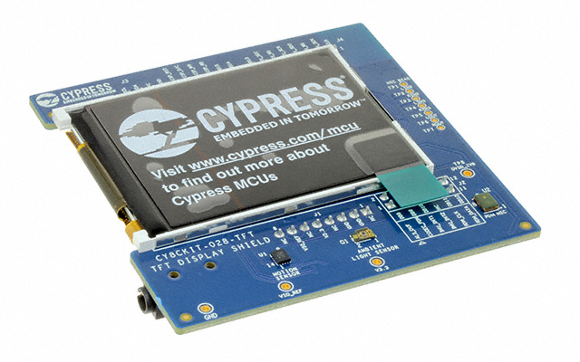

# CY8CKIT-028-TFT shield support library

The TFT Display Shield Board (CY8CKIT-028-TFT) has been designed such that a TFT display, audio devices, and sensors can interface with PSoC MCUs.

It comes with the features below to enable everyday objects to connect to the Internet of Things (IoT).

* 2.4 inch TFT Display (ST7789V)
* Motion Sensor (BMI-160)
* Ambient Light Sensor (TEMT6000X01)
* PDM Microphone example code (SPK0838HT4HB)
* Audio Codec (AK4954A)

This shield has a Newhaven 2.4″ 240×320 TFT display with a Sitronix ST7789 display controller and uses the 8080-Series Parallel Interface.

The shield library provides support for:
* Initializing/freeing all of the hardware peripheral resources on the board
* Defining all pin mappings from the Arduino interface to the different peripherals
* Providing access to each of the underlying peripherals on the board

This library makes use of support libraries: [display-tft-st7789v](https://github.com/cypresssemiconductorco/display-tft-st7789v), [sensor-light](https://github.com/cypresssemiconductorco/sensor-light), [sensor-motion-bmi160](https://github.com/cypresssemiconductorco/sensor-motion-bmi160), and [audio-codec-ak4954a](https://github.com/cypresssemiconductorco/audio-codec-ak4954a). These can be seen in the libs directory and can be used directly instead of through the shield if desired.

The TFT Display Shield Board uses the Arduino Uno pin layout plus an additional 6 pins. It is compatible with the PSoC 4 and PSoC 6 Pioneer Kits. Refer to the respective kit guides for more details.

# Quick Start Guide

* [Display usage](https://github.com/cypresssemiconductorco/display-tft-st7789v#quick-start)
* [Motion Sensor usage](https://github.com/cypresssemiconductorco/sensor-motion-bmi160#quick-start)
* [Light Sensor usage](https://github.com/cypresssemiconductorco/sensor-light#quick-start)
* [Audio Codec usage](https://github.com/cypresssemiconductorco/audio-codec-ak4954a#quick-start)

### More information

* [API Reference Guide](https://cypresssemiconductorco.github.io/CY8CKIT-028-TFT/html/index.html)
* [CY8CKIT-028-TFT Documentation](https://www.cypress.com/documentation/development-kitsboards/tft-display-shield-board-cy8ckit-028-tft)
* [SEGGER emWin Middleware Library](https://github.com/cypresssemiconductorco/emwin)
* [Cypress Semiconductor, an Infineon Technologies Company](http://www.cypress.com)
* [Cypress Semiconductor GitHub](https://github.com/cypresssemiconductorco)
* [ModusToolbox](https://www.cypress.com/products/modustoolbox-software-environment)

---
© Cypress Semiconductor Corporation, 2019-2021.
